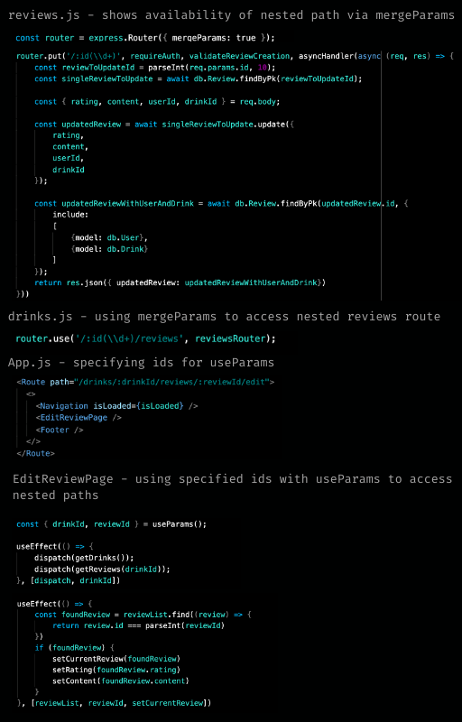

# Welcome to gin & tonnies

## Greetings, fellow cocktail enthusiast!

---

### Menu

[Technologies](#Technologies)

[Key Features](#Key-Features)

[Visit gin & tonnies!](https://gin-and-tonnies.herokuapp.com/)

[Database Schema](https://github.com/jemcodes/ginAndTonnies/wiki/Database-Schema)

[Front End Routes](https://github.com/jemcodes/ginAndTonnies/wiki/Front-End-Routes)

[Backend API Routes](https://github.com/jemcodes/ginAndTonnies/wiki/Backend-API-Routes)

[Details](#Details)

[Feature Spotlight](#Feature-Spotlight)

[Code Snippets](#Code-Snippets)

[Sample Screenshots](#Sample-Screenshots)

[Installation Instructions](#Installation-Instructions)

[Future Features](#Future-Features)

[Meet The Dev](#Meet-The-Dev)

---

### Technologies
* React
* Redux
* Express
* JavaScript
* JSX
* HTML
* CSS
* Sequelize
* PostgreSQL
* Heroku
* VSCode
* Adobe Photoshop
* Adobe XD
* DrawSql
* npm
* Faker

### Key Features

**Drinks**
* View entire list of drinks or select one at a time
* Dynamically create, update, and delete drinks

**Reviews**
* Read reviews for each drink
* Dynamically create, update, and delete reviews

### Details
>"Strike hands with me. The glass is brim. The dew is on the heather. And love is good, and life is long, and friends are best together." - a traditional Scottish toast for the Quaich ceremony

My gin & tonnies Full-Stack Project aims to bring delight to fellow cocktail connoisseurs, highball hobbyists, and every other liquor liker in between. Inspired by Untappd, I've created a community where drink enthusiasts can discover new beverages and share their thoughts on everything they try.

### Visit gin & tonnies
https://gin-and-tonnies.herokuapp.com/

### Feature Spotlight
* I implemented functionality for users to create, read, update, and delete drink listings. Users can also create, read, update, and delete reviews on drink listings.
* There is currently basic front end authorization so current user is guided to only update and delete drinks and reviews they created.
* This was my first solo build of a full React app. I found the integration with Redux to be particularly challenging. With less than a week of knowledge under my belt, I took on the task and I'm quite pleased with the outcome.

**Challenges I faced**

* The learning curve for interacting with the Redux store to grab state was steep for me. It was eye-opening when I finally understood how to connect those dots and select only the information I wanted to show.

* I felt more comfortable with PostgreSQL and Sequelize during this project after having used them in a previous group project. Still, it's a daunting task to make sure all the relationships are implemented correctly, knowing that the functionality of your app depends on it!

### Code Snippets
*Nested routes access*

One task I found challenging was accessing my reviews through my drink id route. I researched and employed mergeParams with useParams to accomplish this. By merging the route on the backend, I was able to write my review update and delete methods as if they were the direct route. Then, on the front end, I assigned the drinkId and reviewId to standin for the correct paths in the URL. From there, I was able to access everything I needed to call upon a single drink, get its reviews, and allow the user to update and delete reviews they'd written.

### Redux Store Tree Samples

*Sample of Redux Store Tree*

*Sample of Redux Store Detail*

### Adobe XD Mock-ups

### Application Screenshots
*Signin Modal*

Welcomes a returning user and offers an option for a new user to signup instead

*Drink List and Navigation*

Navigation bar greets a returning user

*Single Drink Details*

Demonstrates that a user (in this case, nari) does not have authority to update or delete drinks or reviews they did not create

### Installation Instructions
* Git clone the project file
* On your local machine, run 'npm install' to install required dependenices
* Initiate database setup as stated in .env.example
* Run npx dotenv sequelize commands (migrate, seed, etc.)
* Run 'npm start' command on localhost for both backend and front end servers
* Server should automatically navigate you to localhost:port in browser.

---

## Future Features

**Venues**
* See a list of venues associated with drinks
* As a venue owner, create, update, and delete a listing for your venue's details

**Badges**
* Earn badges for trying and reviewing new drinks

**Expanded User Profiles**
* See profile page for each user
* As a user, create, update, and delete details on your profile page
* Drinks and badges dynamically added to your profile

**Additional Protections**
* Amplify security measures, particularly backend considerations, to prevent current user from updating or deleting another user's created drinks and reviews.

### Meet The Dev

* jane martin [Github](https://github.com/jemcodes) [Linkedin](https://www.linkedin.com/in/jemcodes/) 
